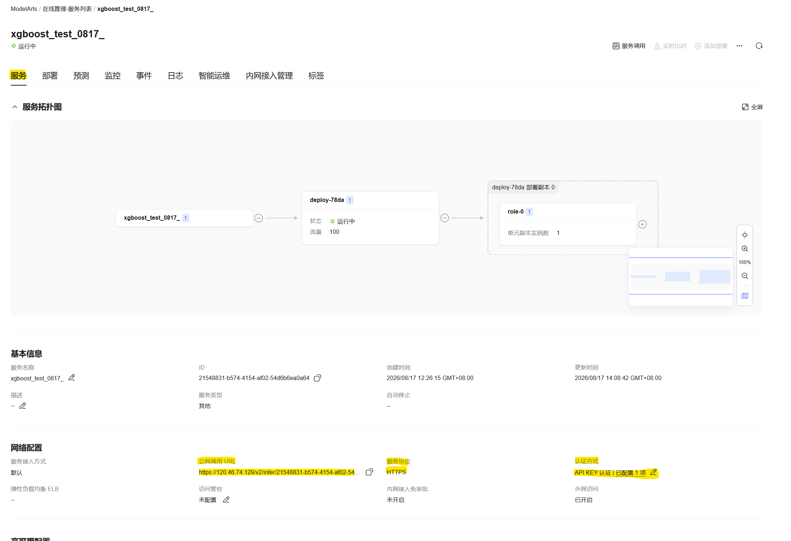
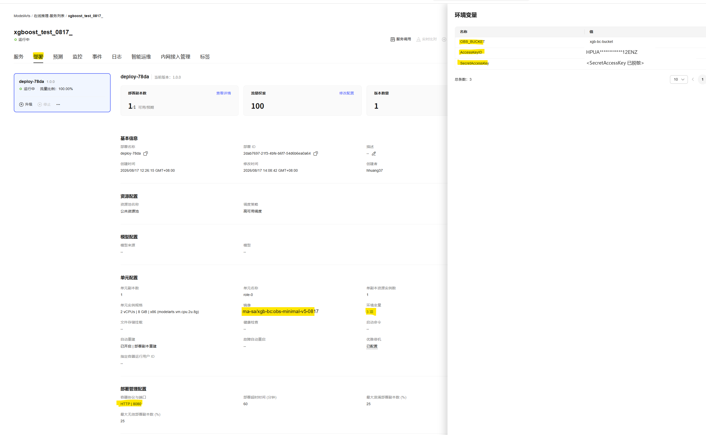

# XGBoost 乳腺癌分类 · 华为云 ModelArts 在线推理 + 零停机热切换

基于 XGBoost 的乳腺癌（breast cancer）二分类模型，打包成**单一 Docker 镜像**部署到华为云 ModelArts 在线推理服务。核心演示能力是**零停机热切换**：把新模型传到 OBS，服务不用重启，下一次推理请求自动用新模型。

核心设计决策：**模型打进镜像作内置兜底，OBS 热切换作运行时增强**——OBS 连不上、凭证缺失时服务照样启动、照样推理，不会因 OBS 侧故障导致服务不可用。

## 特性

- **零停机热切换**：替换 OBS 上的模型对象，下一次请求即生效，无需重启服务/重建容器
- **内置兜底模型**：镜像里自带一份模型，OBS 不可用时自动降级，服务永远能启动
- **双模式自动检测**：要不要连 OBS、怎么发现模型更新，由环境变量自动决定：
  - `OBS_BUCKET` + AK + SK 三项配齐 → **`obs-api` 模式**：连 OBS，每次推理前查云端模型是否更新，支持热切换
  - 缺任意一项 → **`local-signature` 模式**：不连 OBS，只盯本地模型文件变化，适合挂载场景

  选了哪个模式、原因是什么，启动日志会直接写明，`/health` 也能随时查

- **可观测**：启动日志逐条打印 OBS 探活结果，`/health` 实时回答"到底连上 OBS 没有"
- **零脚本依赖**：构建、验证、推送全部是原生 docker / curl / python 命令，照着 README 复制就能跑

## 仓库结构

| 文件 / 目录 | 角色 |
|---|---|
| `app.py` | 统一推理服务（Flask + gunicorn）：模式自动检测、启动探活、热切换、兜底 |
| `Dockerfile` | python:3.11-slim + xgboost + esdk-obs-python，内置兜底模型，满足 ModelArts 镜像契约（ma-user 1000:100） |
| `model/xgboost_breast_cancer.json` | 内置兜底模型（基线模型，100 棵树） |
| `sample_request.json` | 30 特征标准推理请求体 |
| `obs_tool.py` | 容器内 OBS 小工具（可选）：在容器里查 / 备份 / 替换 / 删除 OBS 对象，宿主机装好 Docker 即可用 |
| `verify_hotswap.ipynb` | 新手向完整验证 notebook：训练两套模型 → 健康检查 → 基线推理 → 热切换闭环 |
| `train_upload.ipynb` | 第 1/2 步用：训练两套模型并上传到 OBS（ModelArts Notebook 优先，本地 Jupyter 亦可） |
| `model_out/` | 教程训练产物目录（自己跑第 1 步时生成，已 gitignore） |
| `model_mount/` | 本地 `-v` 挂载验证用（自建即可：把 `model/` 里的模型复制进去，已 gitignore） |

## 准备工作

**华为云侧**（区域默认 `cn-north-4`，换区域需同步改 `OBS_ENDPOINT`）：

- 一个 IAM 用户的 AK/SK（需对其 OBS 桶有读写权限）：控制台 → 我的凭证 → 访问密钥
- 一个 OBS 桶（控制台创建即可），本教程用 `<你的桶名>` 代指
- SWR 镜像仓库的组织名，本教程用 `<组织>` 代指
- ModelArts 在线服务（部署环节用）

**本机侧**：

- Docker（支持 `buildx`）；教程全部用原生 docker / curl / python 命令，任何系统、任何终端通用
- Python ≥ 3.9，训练与验证环节需要：

```bash
pip install xgboost scikit-learn pandas esdk-obs-python requests
```

## 快速开始：本地快速验证（制作镜像 → 启动服务 → 推理）

不需要任何云上凭证，使用镜像内置的兜底模型即可启动服务：

```bash
git clone https://github.com/hhuang37/xgboost-modelarts-demo.git
cd xgboost-modelarts-demo

# 构建镜像（--provenance=false 必须加：不加会产出 OCI Image Index，SWR/ModelArts 拒收）
docker buildx build --platform linux/amd64 --provenance=false -t xgb-bc:obs-minimal-v5 .

# 启动服务（无任何凭证 → 本地签名模式 + 内置兜底模型）
docker run --rm -d --name xgb-0817-test -p 18081:8080 xgb-bc:obs-minimal-v5

# 健康检查 + 推理 + 看启动日志
curl http://127.0.0.1:18081/health
curl -X POST http://127.0.0.1:18081/ -H "Content-Type: application/json" --data-binary @sample_request.json
docker logs xgb-0817-test

# 用完清理
docker rm -f xgb-0817-test
```

正常输出：`/health` 返回 `"sync_mode": "local-signature"`、`"model_origin": "baked"`（无凭证 → 本地签名模式 + 内置模型），推理返回 `[{"predictresult": 0.05...}]`。

想看真正的热切换（OBS 模式）→ 走下面的完整流程。

## 完整上云流程（新手向六步）

从训练模型，到把模型上传 OBS、制作镜像、推 SWR、在线部署，最后用 Python 代码检查结果。

### 第 1 步 · 训练模型（在 ModelArts Notebook 上跑）

打开 **`train_upload.ipynb`**（上传到 ModelArts 的 Notebook 运行；本地 Jupyter 也能跑）：

1. **§1 配置区**：填 `OBS_BUCKET`（绑了 OBS 委托的 Notebook，AK/SK 留空即可）
2. **§2–§4**：自动处理 ModelArts 环境的依赖安装与 moxing 认证
3. **§5 / §6**：训练两套模型，产物保存在 `model_out/old/` 与 `model_out/new/`

| 模型 | 超参 | random_state | 作用 |
|---|---|---|---|
| 旧（基线） | 100 棵树、max_depth 3、learning_rate 0.1 | 42 | 与镜像内置模型一致 |
| 新 | 250 棵树、max_depth 6、learning_rate 0.01、加正则化 | 2024 | 预测值与旧模型不同，验证热切换时能看到变化 |

### 第 2 步 · 上传模型到 OBS

同一本 notebook 的 **§7**：`ACTIVE_MODEL = "old"` 时，把基线模型传到 OBS 单一目标路径：

- 目标路径：`obs://<你的桶名>/models/xgboost_breast_cancer.json`
- 这个 key（`models/xgboost_breast_cancer.json`）就是部署时 `OBS_KEY` 的默认值，无需修改
- 优先使用 moxing（委托自动认证）；没有委托时自动回退到 esdk-obs-python（需要 AK/SK）

> 如需切换线上模型：把 `ACTIVE_MODEL` 改成 `"new"` 重跑 §7 即可，服务会在下一次请求自动热切换。

### 第 3 步 · 制作镜像

```bash
docker buildx build --platform linux/amd64 --provenance=false -t xgb-bc:obs-minimal-v5 .
```

说明：镜像构建时会把 `model/xgboost_breast_cancer.json` 打进去作**内置兜底模型**。如需换成自己的模型，替换该文件后重新构建即可；未替换也不影响使用，兜底模型只在 OBS 不可用时才被使用。

### 第 4 步 · 推送镜像到 SWR

```bash
docker login -u cn-north-4@<IAM账号> swr.cn-north-4.myhuaweicloud.com

docker tag xgb-bc:obs-minimal-v5 swr.cn-north-4.myhuaweicloud.com/<组织>/xgb-bc:obs-minimal-v5-0817
docker push swr.cn-north-4.myhuaweicloud.com/<组织>/xgb-bc:obs-minimal-v5-0817
```

推送完成后在 SWR 控制台确认仓库、tag、架构 amd64 无误。

### 第 5 步 · ModelArts 在线部署（环境变量配置说明）

ModelArts 在线服务用 SWR 里的这个镜像创建，要点：

- 容器端口 **8080**（gunicorn 绑定 0.0.0.0:8080）
- 健康检查：HTTP `GET /health`
- **不需要存储挂载**：模型已内置，OBS 同步走环境变量配置的 AK/SK
- 规格从小开始（1 副本、默认调度即可）

> ⚠️ **HTTP 与 HTTPS 的配置区别**：
> - **部署表单 → 部署管理配置 → 容器协议与端口** 选 **HTTP | 8080**（gunicorn 监听的就是 HTTP）
> - **服务创建成功后 → 服务面板** 的 **服务协议** 会显示 **HTTPS**（平台在入口网关统一终结 TLS）
>
> 两层协议不冲突：**容器内 HTTP，对外 HTTPS**，是 ModelArts 默认行为，不要在部署表单里强行把容器协议改成 HTTPS（gunicorn 不会自己起 TLS，会起不来）。

部署成功后回到服务列表点开服务名，**服务面板** 里有三个字段是第 6 步要用的，**先在这里准备好**：

#### ① 公网调用 URL（第 6 步 `INFER_URL` 必填）



在服务面板 **网络配置 → 公网调用 URL**，形如：

```text
https://120.46.74.129/v2/infer/21548831-b574-4154-af02-54d6b6ea0a64
```

> **请复制完整 URL**，第 6 步 `verify_hotswap.ipynb` 的 §1 需要将其填入 `INFER_URL`（或环境变量 `MODELARTS_OBS_INFER_URL`）。请勿截断或附加末尾斜杠，整段直接粘贴。

#### ② 认证方式：API Key 绑定（第 6 步 `API_KEY` 必填）

服务面板 **认证方式** 一栏显示 `API KEY 认证 | 已配置 1 项`。首次部署时需点击右侧的编辑按钮：

1. 弹出的 **已绑定的 API Key** 面板里点 **绑定 API Key**
2. 系统会生成一个 Key（如 `api-1704`）并**自动下载一个 CSV**（文件名形如 `api-1704.csv`）
3. ⚠️ **这个 CSV 只下载一次，关掉就再也看不到完整 Key**。立即保存到本地安全位置
4. CSV 里有一列就是 API Key 值——**第 6 步代码里的 `API_KEY` / `MODELARTS_API_KEY` 就是从这里取的**，请求时会被 `verify_hotswap.ipynb` 拼到请求头 `Authorization: Bearer <API_KEY>` 里

> 若 CSV 文件丢失：回到绑定面板将该 Key **解绑**，再 **绑定 API Key** 重新生成一个，系统会重新下载新的 CSV。

#### ③ 服务协议 / 容器协议（常见配置错误，详见上文 ⚠️ 说明）

- 服务面板 **服务协议 = HTTPS**（平台对外终结 TLS）→ 你**对外调用**一律用 `https://` 开头的公网 URL
- 部署管理配置 **容器协议与端口 = HTTP | 8080** → 这是**容器内** gunicorn 的协议，**不要改成 HTTPS**

第 6 步代码里：`INFER_URL` 用的是**①的 HTTPS 公网 URL**；②的 CSV 提供 `API_KEY`；③只是部署时的协议选择，验证代码里不用管。



**模型在 OBS 上的地址与参数对应**（桶名以 `xgb-bc-bucket` 为例）：

```text
obs://xgb-bc-bucket/models/xgboost_breast_cancer.json
      └─OBS_BUCKET┘ └────────────OBS_KEY────────────┘
```

> `obs://` 只是 OBS 地址的协议前缀，**不属于任何参数**；域名 `obs.cn-north-4.myhuaweicloud.com` 对应 `OBS_ENDPOINT`。部署时把 `OBS_BUCKET`、`OBS_KEY`、`OBS_ENDPOINT` 换成自己的即可。

环境变量是 `app.py` 的全部开关，按需填写：

| 环境变量 | 默认值 | 配置方式 | 说明 |
|---|---|---|---|
| `OBS_BUCKET` | 空（参考值：`xgb-bc-bucket`） | **部署时必填** | 你的 OBS 桶名（就是地址 `obs://` 后面、第一个 `/` 之前那段）。与 AK/SK 同时配置才启用 OBS API 模式（热切换） |
| `AccessKeyID` | 空 | **部署时必填** | IAM 用户 AK |
| `SecretAccessKey` | 空 | **部署时必填** | IAM 用户 SK |
| `OBS_KEY` | `models/xgboost_breast_cancer.json` | 通常不改 | 模型对象在桶里的 key，和第 2 步上传的一致即可 |
| `OBS_ENDPOINT` | `https://obs.cn-north-4.myhuaweicloud.com` | 换区域才改 | OBS 区域端点 |
| `MODEL_PATH` | `/opt/model/xgboost_breast_cancer.json` | **保持默认** | 容器内模型路径，内置兜底模型就在这个位置 |
| `OBS_HOT_RELOAD_DISABLE` | `false` | **保持默认** | `true` = 强制本地签名模式（禁用 OBS 同步） |
| `OBS_DOWNLOAD_FORCE` | `false` | **保持默认** | `true` = 每次启动强制重新下载 OBS 模型 |
| `OBS_DOWNLOAD_TIMEOUT` | `30` | 网络状况较差时可增大 | 单次 OBS 请求超时（秒） |

**判定规则**：`OBS_BUCKET` + `AccessKeyID` + `SecretAccessKey` 三个都填 = OBS API 模式（支持热切换）；缺少任意一项 = 本地签名模式（只用内置/挂载的模型，不会连 OBS）。

部署后应先检查服务启动日志（搜 `xgb-obs`）确认有 `[obs-probe] ok status=200`，再进行后续验证。

### 第 6 步 · 用 Python 检查结果（含热切换闭环）

验证全部在 **`verify_hotswap.ipynb`** 里完成（Jupyter 打开后，按 §1 把服务地址与凭证填好，依次运行）：

> **注意**：§1 要填的两个关键值都在**第 5 步部署成功后的服务面板**里：
> - `INFER_URL` ← 服务面板 **网络配置 → 公网调用 URL**（HTTPS 开头那串，详见第 5 步 ①）
> - `API_KEY` ← 服务面板 **认证方式 → 已绑定的 API Key** 弹层里下载的 `api-XXXX.csv` 文件（详见第 5 步 ②）

1. **§3 健康检查**——`/health` 的 `model_source` 以 `obs://` 开头，确认模型已从 OBS 同步
2. **§4 基线推理**——记下当前 `predictresult`
3. **§5 热切换验证**——notebook 用"先 `deleteObject` 再 `putFile`"替换 OBS 上的模型对象，再推理一次
4. **§5 步骤 3 自动判定**——前后预测值差异 > 1e-6 即热切换成功（服务全程未重启）

> **判定标准**：热切换以"换模型前后预测值发生变化"为准。参考值：旧模型 ≈ `0.050855...`，新模型 ≈ `0.118065...`；你的预测绝对值以自己训练结果为准，不应直接照搬上述数值。
>
> 本地 docker 同样可验证：服务地址填 `http://127.0.0.1:18081/`，notebook 会自动切换成本地模式。

## 工作原理

### 同步模式矩阵（自动检测，启动日志会说明原因）

| 环境变量 | 模式 | 行为 |
|---|---|---|
| `OBS_BUCKET` + `AccessKeyID` + `SecretAccessKey` 齐全 | `obs-api` | 启动探活 OBS 并下载/比对；每次请求前查 OBS 对象大小，不一致就重新下载并重加载（**OBS API 模式**） |
| 任一凭证缺失，或 `OBS_HOT_RELOAD_DISABLE=true` | `local-signature` | 只看本地模型文件的 (mtime, size)，变化即重载（**本地签名模式**）。适用存储挂载 / 本地 `-v` 挂载 |
| — 公共行为 — | | OBS 任何失败都降级到内置兜底模型并打 WARNING，**不阻塞启动**；只有"完全没有模型可服务"才让容器失败 |

### 确认启动时 OBS 连通性的方法

1. **看启动日志**（ModelArts 服务日志里搜 `xgb-obs`）：
   - `[startup] obs config: endpoint=... bucket=... key=... ak=FAKE****` — 解析后的配置，AK 掩码
   - `[startup] sync mode resolved: obs-api (...)` — 最终选定的模式及其原因
   - `[obs-probe] ok status=200 remote_size=...` 或 `[obs-probe] FAILED status=403 ...` — 探活结果
   - `[startup] OBS unreachable (status=...) — FALLING BACK TO BAKED-IN MODEL` — 降级兜底（醒目 WARNING）
2. **看 `/health`**：`sync_mode` / `sync_mode_reason` / `model_origin`（`obs` 或 `baked`）/ `obs.last_check_ok` / `obs.last_status_code` / `obs.error`

## 已验证清单（2026-08-17 全部通过）

| 验证项 | 方式 | 结果 |
|---|---|---|
| 本地·真凭证全链路 | 本地 docker 以 OBS API 模式启动（`docker run -e OBS_BUCKET=... -e AccessKeyID=... -e SecretAccessKey=... ...`），`verify_hotswap.ipynb` 指向 `http://127.0.0.1:18081/` | 全部 PASS：探活 200、启动下载、换模型后预测值变化、日志出现 `[hot-reload]`、重启走启动下载路径、OBS 对象恢复原状 |
| 推送 SWR | `docker tag` + `docker push`（tag `obs-minimal-v5-0817`） | 推送成功，控制台确认 amd64 |
| ModelArts 在线部署 | 统一镜像部署在线服务 | 服务运行中，启动日志 `[obs-probe] ok`，`/health` 正常 |
| 云上热切换闭环 | `verify_hotswap.ipynb`（云端服务） | 不重启服务，替换 OBS 对象后预测值变化 |

## 排障

| 现象 | 原因 | 解决 |
|---|---|---|
| 云上替换 OBS 对象后热切换不生效 | OBS 文件系统的 mtime 不刷新 | 沿用"先 `deleteObject` 再 `putFile`"两步走（本仓库验证代码已实现） |
| 本地 docker 热切换不生效 | 本地签名模式需要 `-v` 挂载模型目录 | 重建容器加 `-v model_mount:/opt/model`，替换挂载目录里的模型文件 |
| `/health` 的 `model_source` 不以 `obs://` 开头 | `OBS_BUCKET`/AK/SK 没配齐，没进 OBS API 模式 | 三个环境变量配齐后重启；看 `sync_mode_reason` 说明缺哪个 |
| `[obs-probe] FAILED status=403` | AK/SK 无效或无该桶权限 | 核对 AK/SK 与桶策略；服务仍以兜底模型运行，不会中断 |
| 推理 401/403 | API Key 无效 | 检查请求头的 Bearer Token |
| 服务起不来 + `MountVolume.SetUp failed ... configmap ... not found` | Kubernetes 平台层错误，发生在容器启动之前，与镜像内容无关 | 删除服务重建；仍失败则对照能正常运行的配置逐项核对（规格/调度/副本/资源池/存储挂载），或提交工单联系平台管理员 |

## License

仅用于个人学习与演示。
