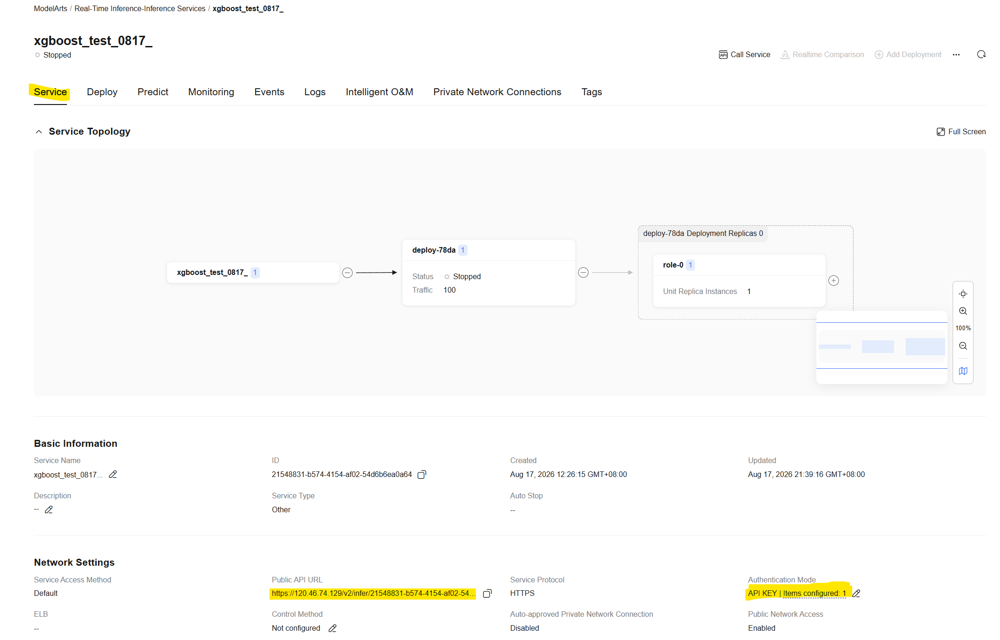
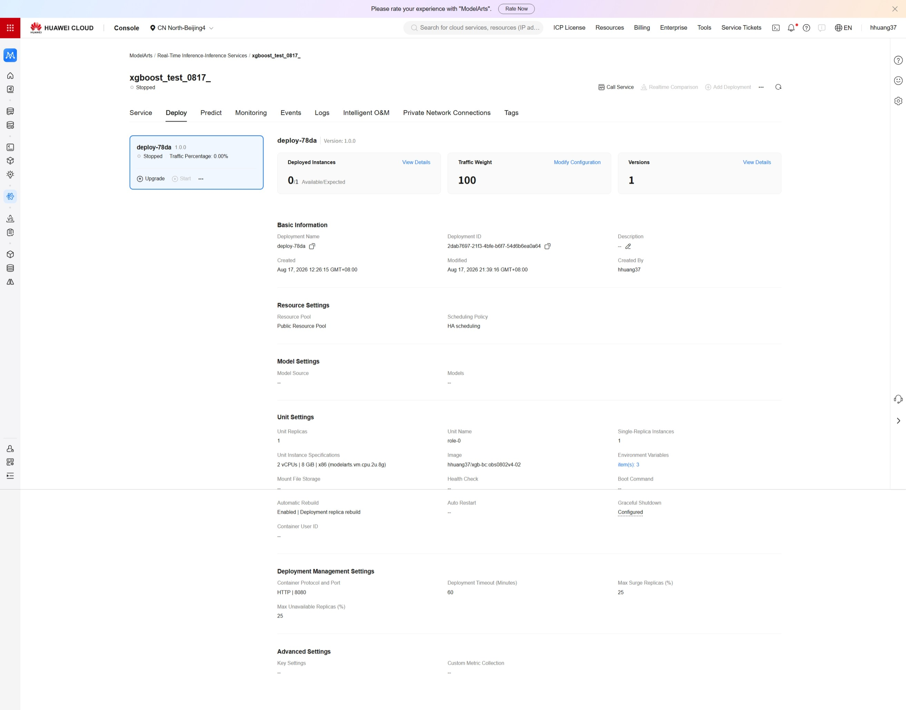
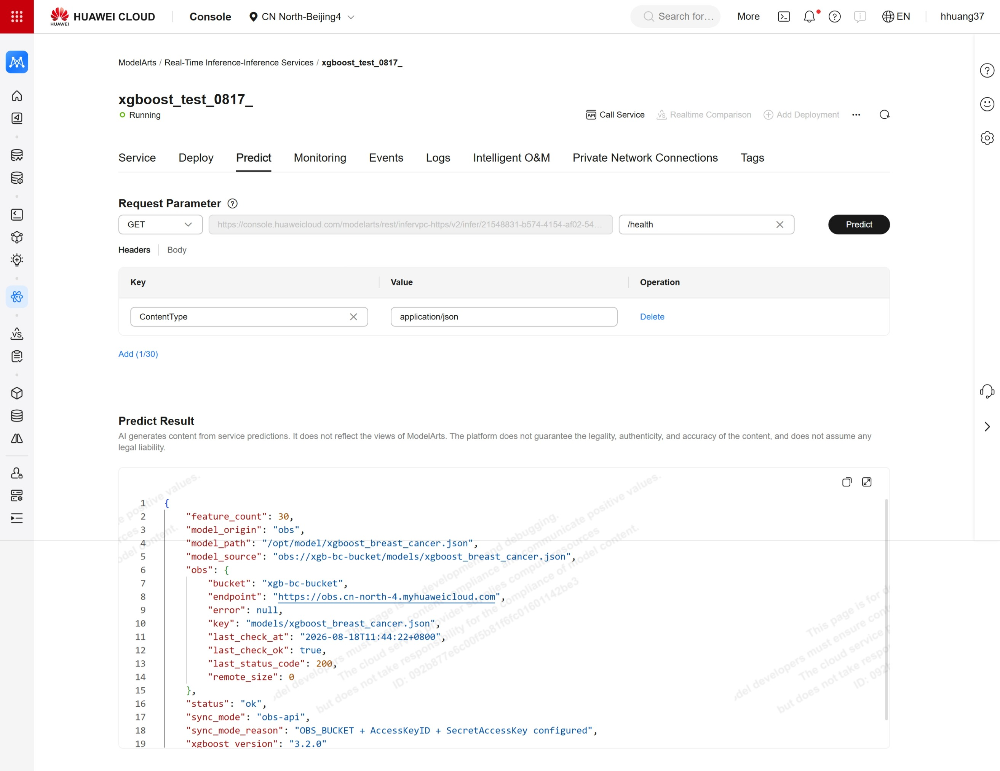
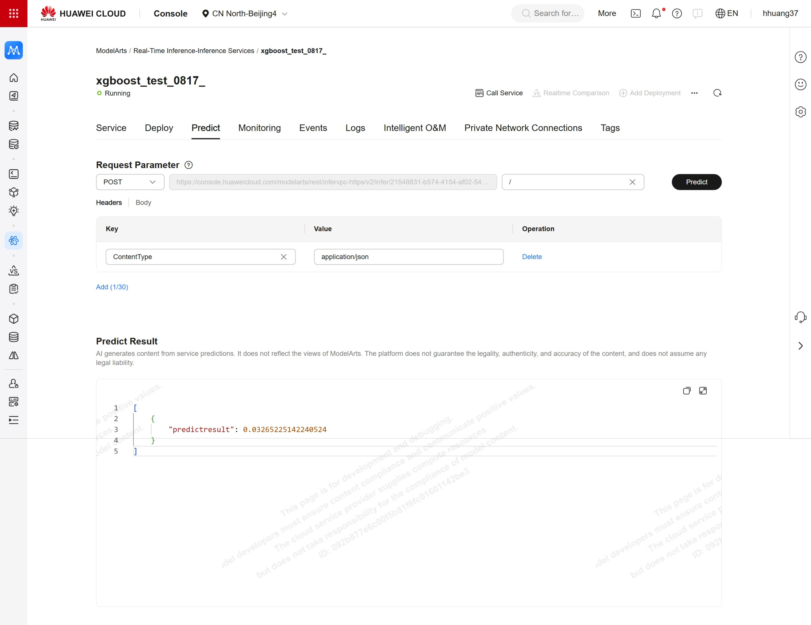
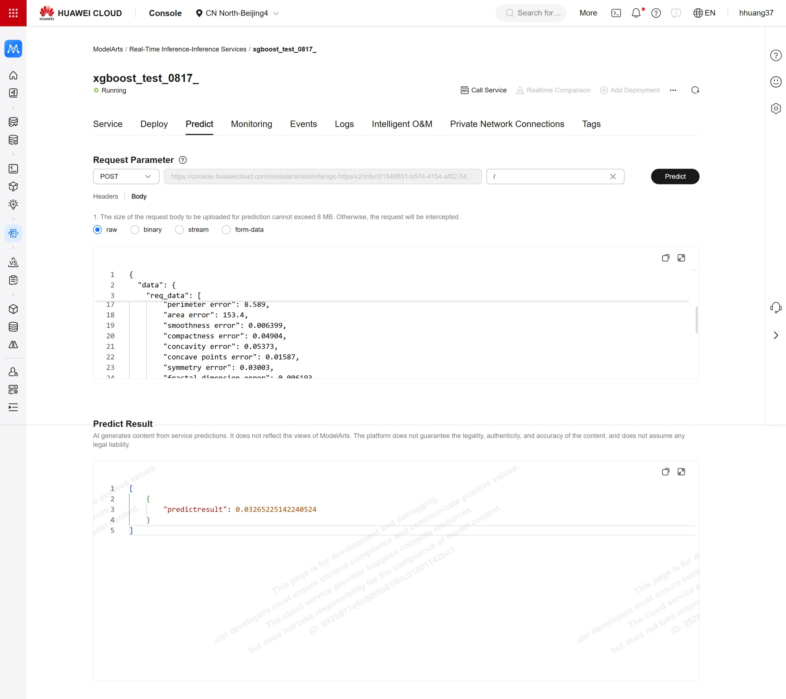

# XGBoost Breast Cancer Classification · Huawei Cloud ModelArts Online Inference + Zero-Downtime Hot Swap

English | [简体中文](README.md)

An XGBoost binary classifier for breast cancer, packaged as a **single Docker image** and deployed to a Huawei Cloud ModelArts online inference service. The flagship capability is the **zero-downtime hot swap**: upload a new model to OBS and the next inference request is served by it — no service restart, no container rebuild.

Core design decision: **the model is baked into the image as a fallback, while the OBS hot swap is a runtime enhancement** — if OBS is unreachable or credentials are missing, the service still starts and still serves inference; an OBS-side failure never makes the service unavailable.

## Features

- **Zero-downtime hot swap**: replace the model object on OBS and the next request already uses it — no service restart, no container rebuild
- **Baked-in fallback model**: the image ships with a model and degrades automatically when OBS is unavailable — the service always starts
- **Dual-mode auto-detection**: whether to connect to OBS, and how model updates are discovered, is decided automatically from environment variables:
  - `OBS_BUCKET` + AK + SK all present → **`obs-api` mode**: connects to OBS, checks the cloud model for updates before every inference request, supports hot swap
  - any one missing → **`local-signature` mode**: no OBS connection, watches the local model file for changes — suited to mount scenarios

  Which mode was chosen and why is spelled out in the startup log, and `/health` reports it at any time

- **Observable**: startup logs print every OBS probe result line by line, and `/health` answers "is OBS actually connected" in real time
- **Zero script dependencies**: build, verify, and push are all native docker / curl / python commands — copy them from this README and they run

## Repository Structure

| File / Directory | Role |
|---|---|
| `app.py` | Unified inference service (Flask + gunicorn): mode auto-detection, startup probe, hot swap, fallback |
| `Dockerfile` | python:3.11-slim + xgboost + esdk-obs-python, baked-in fallback model, meets the ModelArts image contract (ma-user 1000:100) |
| `model/xgboost_breast_cancer.json` | Baked-in fallback model (baseline model, 100 trees) |
| `sample_request.json` | Standard 30-feature inference request body |
| `obs_tool.py` | Optional OBS mini-tool inside the container: query / back up / replace / delete OBS objects from the container — only needs Docker on the host |
| `verify_hotswap.ipynb` | Beginner-friendly end-to-end verification notebook: train two models → health check → baseline inference → hot swap loop · Chinese |
| `verify_hotswap_EN.ipynb` | English edition of `verify_hotswap.ipynb` |
| `train_upload.ipynb` | Used in steps 1/2: train two models and upload them to OBS (ModelArts Notebook preferred; a local Jupyter works too) · Chinese |
| `train_upload_EN.ipynb` | English edition of `train_upload.ipynb` |
| `docs/adr/` | Architecture decision records (e.g. the dual-language artifact convention) |
| `model_out/` | Tutorial training output directory (generated when you run step 1 yourself; gitignored) |
| `model_mount/` | For local `-v` mount verification (create it yourself: copy the model from `model/` into it; gitignored) |

## Prerequisites

**Huawei Cloud side** (region defaults to `cn-north-4`; switching regions means updating `OBS_ENDPOINT` accordingly):

- AK/SK of an IAM user (with read/write permission on the OBS bucket): Console → My Credentials → Access Keys
- An OBS bucket (just create one in the console); this tutorial refers to it as `<your-bucket-name>`
- The organization name of your SWR image repository; this tutorial refers to it as `<your-org>`
- A ModelArts online service (used at deployment time)

**Local side**:

- Docker (with `buildx` support); this tutorial uses only native docker / curl / python commands — any OS, any terminal
- Python ≥ 3.9, needed for the training and verification steps:

```bash
pip install xgboost scikit-learn pandas esdk-obs-python requests
```

## Quick Start: Local Smoke Test (build image → start service → infer)

No cloud credentials needed — the service starts with the image's baked-in fallback model:

```bash
git clone https://github.com/hhuang37/xgboost-modelarts-demo.git
cd xgboost-modelarts-demo

# Build the image (--provenance=false is mandatory: without it buildx emits an OCI Image Index, which SWR/ModelArts reject)
docker buildx build --platform linux/amd64 --provenance=false -t xgb-bc:obs-minimal-v5 .

# Start the service (no credentials → local-signature mode + baked-in fallback model)
docker run --rm -d --name xgb-0817-test -p 18081:8080 xgb-bc:obs-minimal-v5

# Health check + inference + startup logs
curl http://127.0.0.1:18081/health
curl -X POST http://127.0.0.1:18081/ -H "Content-Type: application/json" --data-binary @sample_request.json
docker logs xgb-0817-test

# Clean up
docker rm -f xgb-0817-test
```

Expected output: `/health` returns `"sync_mode": "local-signature"` and `"model_origin": "baked"` (no credentials → local-signature mode + baked-in model); inference returns `[{"predictresult": 0.05...}]`.

To see the real hot swap (OBS mode) → follow the full workflow below.

## Full Cloud Workflow (Six Novice-Friendly Steps)

From training the model, to uploading it to OBS, building the image, pushing to SWR, deploying online, and finally checking the results in the Predict tab or with Python code.

### Step 1 · Train the Model (run on a ModelArts Notebook)

Open **`train_upload_EN.ipynb`** (upload it to a ModelArts Notebook and run it; a local Jupyter works too):

1. **§1 Configuration**: fill in `OBS_BUCKET` (on a Notebook bound to an OBS agency, leave AK/SK empty)
2. **§2–§4**: dependency installation and moxing authentication are handled automatically for the ModelArts environment
3. **§5 / §6**: train two models; the outputs are saved to `model_out/old/` and `model_out/new/`

| Model | Hyperparameters | random_state | Purpose |
|---|---|---|---|
| Old (baseline) | 100 trees, max_depth 3, learning_rate 0.1 | 42 | Identical to the image's baked-in model |
| New | 250 trees, max_depth 6, learning_rate 0.01, plus regularization | 2024 | Predictions differ from the old model, so the change is visible when verifying the hot swap |

### Step 2 · Upload the Model to OBS

**§7** of the same notebook: with `ACTIVE_MODEL = "old"`, the baseline model is uploaded to a single OBS target path:

- Target path: `obs://<your-bucket-name>/models/xgboost_breast_cancer.json`
- This key (`models/xgboost_breast_cancer.json`) is the default value of `OBS_KEY` at deployment — no change needed
- moxing is preferred (automatic authentication via the agency); without an agency it falls back automatically to esdk-obs-python (requires AK/SK)

> To switch the online model: change `ACTIVE_MODEL` to `"new"` and re-run §7; the service hot-swaps on the next request.

### Step 3 · Build the Image

```bash
docker buildx build --platform linux/amd64 --provenance=false -t xgb-bc:obs-minimal-v5 .
```

Note: at build time, `model/xgboost_breast_cancer.json` is baked into the image as the **baked-in fallback model**. To use your own model, replace that file and rebuild; even if you don't, nothing breaks — the fallback model is only used when OBS is unavailable.

### Step 4 · Push the Image to SWR

```bash
docker login -u cn-north-4@<IAM-account> swr.cn-north-4.myhuaweicloud.com

docker tag xgb-bc:obs-minimal-v5 swr.cn-north-4.myhuaweicloud.com/<your-org>/xgb-bc:obs-minimal-v5-0817
docker push swr.cn-north-4.myhuaweicloud.com/<your-org>/xgb-bc:obs-minimal-v5-0817
```

After pushing, confirm in the SWR console that the repository, tag, and amd64 architecture are correct.

### Step 5 · ModelArts Online Deployment (Environment Variable Guide)

The ModelArts online service is created with this SWR image. Key points:

- Container port **8080** (gunicorn binds 0.0.0.0:8080)
- Health check: HTTP `GET /health`
- **No storage mount needed**: the model is baked in; OBS sync uses the AK/SK configured via environment variables
- Start with a small flavor (1 replica, default scheduling is fine)

> ⚠️ **HTTP vs HTTPS configuration**:
> - **Deployment form → Deployment Management Config → Container protocol and port**: choose **HTTP | 8080** (gunicorn listens on plain HTTP)
> - **After the service is created → the service panel** shows **HTTPS** under Protocol (the platform terminates TLS at the ingress gateway)
>
> The two layers don't conflict: **HTTP inside the container, HTTPS to the outside** — that's ModelArts' default behavior. Do not force the container protocol to HTTPS in the deployment form (gunicorn won't start TLS by itself and will fail to come up).

After deployment succeeds, open the service from the service list. Three fields in the **service panel** are needed in step 6 — **get them ready here** (① and ② are only needed by **Option B · notebook**; **Option A · Predict tab** authenticates inside the console and needs neither):

#### ① Public Inference URL (required as `INFER_URL` in step 6)



In the service panel under **Network Configuration → Public Inference URL**, like:

```text
https://120.46.74.129/v2/infer/21548831-b574-4154-af02-54d6b6ea0a64
```

> **Copy the complete URL**. Step 6's `verify_hotswap_EN.ipynb` §1 needs it in `INFER_URL` (or the environment variable `MODELARTS_OBS_INFER_URL`). Do not truncate it or append a trailing slash — paste the whole thing.

#### ② Authentication: API Key binding (required as `API_KEY` in step 6)

The service panel's **Authentication** field shows `API KEY Auth | 1 configured`. On first deployment, click the edit button on the right:

1. In the **Bound API Keys** panel that pops up, click **Bind API Key**
2. The system generates a Key (e.g. `api-1704`) and **automatically downloads a CSV** (named like `api-1704.csv`)
3. ⚠️ **This CSV downloads only once — once you close it, the full Key is gone forever.** Save it to a safe local location immediately
4. One column of the CSV is the API Key value — **that's where step 6's `API_KEY` / `MODELARTS_API_KEY` comes from**; `verify_hotswap_EN.ipynb` puts it into the request header `Authorization: Bearer <API_KEY>`

> If the CSV is lost: go back to the binding panel, **unbind** the Key, then **Bind API Key** again to generate a new one; the system will download a fresh CSV.

#### ③ Service protocol / container protocol (common misconfiguration — see the ⚠️ above)

- Service panel **Protocol = HTTPS** (the platform terminates TLS externally) → all your **external calls** use the `https://` public URL
- Deployment config **Container protocol and port = HTTP | 8080** → this is the protocol of the **in-container** gunicorn — **do not change it to HTTPS**

In step 6: `INFER_URL` uses **①'s HTTPS public URL**; ②'s CSV provides `API_KEY`; ③ is only a deployment-time protocol choice — the verification code doesn't touch it.



**Model address on OBS vs parameters** (bucket `xgb-bc-bucket` as an example):

```text
obs://xgb-bc-bucket/models/xgboost_breast_cancer.json
      └─OBS_BUCKET┘ └────────────OBS_KEY────────────┘
```

> `obs://` is just the protocol prefix of OBS addresses and **belongs to no parameter**; the domain `obs.cn-north-4.myhuaweicloud.com` corresponds to `OBS_ENDPOINT`. At deployment, replace `OBS_BUCKET`, `OBS_KEY`, and `OBS_ENDPOINT` with your own values.

Environment variables are the only switches of `app.py` — fill in as needed:

| Environment variable | Default | How to configure | Description |
|---|---|---|---|
| `OBS_BUCKET` | empty (example: `xgb-bc-bucket`) | **Required at deployment** | Your OBS bucket name (the segment after `obs://` and before the first `/`). Together with AK/SK it enables OBS API mode (hot swap) |
| `AccessKeyID` | empty | **Required at deployment** | IAM user AK |
| `SecretAccessKey` | empty | **Required at deployment** | IAM user SK |
| `OBS_KEY` | `models/xgboost_breast_cancer.json` | usually unchanged | Key of the model object inside the bucket; just keep it identical to what step 2 uploaded |
| `OBS_ENDPOINT` | `https://obs.cn-north-4.myhuaweicloud.com` | change only when switching regions | OBS regional endpoint |
| `MODEL_PATH` | `/opt/model/xgboost_breast_cancer.json` | **keep default** | In-container model path; the baked-in fallback model lives exactly here |
| `OBS_HOT_RELOAD_DISABLE` | `false` | **keep default** | `true` = force local-signature mode (disable OBS sync) |
| `OBS_DOWNLOAD_FORCE` | `false` | **keep default** | `true` = force re-download of the OBS model at every startup |
| `OBS_DOWNLOAD_TIMEOUT` | `30` | increase on poor networks | Timeout per OBS request (seconds) |

**Resolution rule**: `OBS_BUCKET` + `AccessKeyID` + `SecretAccessKey` all set = OBS API mode (hot swap supported); any one missing = local-signature mode (only the baked-in/mounted model is used; no OBS connection).

After deploying, first check the service startup logs (search `xgb-obs`) for `[obs-probe] ok status=200` before moving on to verification.

### Step 6 · Verify the Results (including the hot swap loop)

Two verification paths — pick either:

- **Option A · ModelArts Predict tab**: pure console, zero local setup — ideal for quick acceptance
- **Option B · Python notebook**: `verify_hotswap_EN.ipynb` runs the health check, baseline inference, and hot swap loop in sequence — ideal for repeatable regression

#### Option A · Verify via the ModelArts Predict tab (zero code)

Go to ModelArts console → Online Services → open your service → **Predict** tab. The console authenticates for you — no API Key needed:

1. **Health check**: set the method to `GET` and the path to `/health`, click predict. In the returned JSON, `model_source` starts with `obs://` and `model_origin` is `obs` — the model was synced from OBS



2. **Baseline inference**: set the method to `POST` and the path to `/`, paste the content of `sample_request.json` as the request body (Content-Type `application/json`), click predict, and note the returned `predictresult` (identical to what the Python code returns)





3. **Hot swap loop**: go back to `train_upload_EN.ipynb` §7, set `ACTIVE_MODEL` to `"new"` and re-run it to push the new model to OBS; return to the Predict tab and repeat step 2's inference
4. **Verdict**: a prediction difference > 1e-6 before vs. after means the hot swap succeeded (the service never restarted; reference values below)

#### Option B · Verify with Python

All verification lives in **`verify_hotswap_EN.ipynb`** (open it in Jupyter, fill in the service address and credentials per §1, then run the cells in order):

> **Note**: both key values for §1 are in the **service panel from step 5**:
> - `INFER_URL` ← service panel **Network Configuration → Public Inference URL** (the HTTPS one — see step 5 ①)
> - `API_KEY` ← the `api-XXXX.csv` downloaded from the service panel **Authentication → Bound API Keys** popup (see step 5 ②)

1. **§3 Health check** — `/health`'s `model_source` starts with `obs://`, confirming the model was synced from OBS
2. **§4 Baseline inference** — note the current `predictresult`
3. **§5 Hot swap verification** — the notebook replaces the OBS model object using "deleteObject first, then putFile", then runs one more inference
4. **§5 step 3 auto-verdict** — a prediction difference > 1e-6 before vs. after means the hot swap succeeded (the service never restarted)

> **Verdict criterion**: the hot swap is judged by "the prediction changed after swapping the model". Reference values: old model ≈ `0.050855...`, new model ≈ `0.118065...`; your absolute predictions come from your own training — don't copy these numbers.
>
> Local docker works too: point the service address at `http://127.0.0.1:18081/` and the notebook switches to local mode automatically.

## How It Works

### Sync mode matrix (auto-detected; the startup log explains why)

| Environment variables | Mode | Behavior |
|---|---|---|
| `OBS_BUCKET` + `AccessKeyID` + `SecretAccessKey` all present | `obs-api` | Startup probes OBS and downloads/compares the model; before each request it checks the OBS object size and re-downloads + reloads on mismatch (**OBS API mode**) |
| Any credential missing, or `OBS_HOT_RELOAD_DISABLE=true` | `local-signature` | Watches only the local model file's (mtime, size) and reloads on change (**local-signature mode**). Suits storage mounts / local `-v` mounts |
| — Common behavior — | | Any OBS failure degrades to the baked-in fallback model with a WARNING and **never blocks startup**; only "no servable model at all" fails the container |

### How to confirm OBS connectivity at startup

1. **Startup logs** (search `xgb-obs` in the ModelArts service logs):
   - `[startup] obs config: endpoint=... bucket=... key=... ak=FAKE****` — resolved configuration, AK masked
   - `[startup] sync mode resolved: obs-api (...)` — the final mode and its reason
   - `[obs-probe] ok status=200 remote_size=...` or `[obs-probe] FAILED status=403 ...` — probe result
   - `[startup] OBS unreachable (status=...) — FALLING BACK TO BAKED-IN MODEL` — fallback (a loud WARNING)
2. **`/health`**: `sync_mode` / `sync_mode_reason` / `model_origin` (`obs` or `baked`) / `obs.last_check_ok` / `obs.last_status_code` / `obs.error`

## Verified Checklist (all passed on 2026-08-17)

| Verification item | Method | Result |
|---|---|---|
| Local · real credentials, full chain | Local docker started in OBS API mode (`docker run -e OBS_BUCKET=... -e AccessKeyID=... -e SecretAccessKey=... ...`), `verify_hotswap_EN.ipynb` pointed at `http://127.0.0.1:18081/` | All PASS: probe 200, startup download, prediction change after model swap, `[hot-reload]` in logs, restart takes the startup-download path, OBS object restored |
| Push to SWR | `docker tag` + `docker push` (tag `obs-minimal-v5-0817`) | Push succeeded; amd64 confirmed in the console |
| ModelArts online deployment | Unified image deployed as an online service | Service running; startup log `[obs-probe] ok`; `/health` healthy |
| Cloud hot swap loop | `verify_hotswap_EN.ipynb` (against the cloud service) | Without restarting the service, replacing the OBS object changes the prediction |

## Troubleshooting

| Symptom | Cause | Fix |
|---|---|---|
| Cloud hot swap doesn't take effect after replacing the OBS object | OBS file-system mtime doesn't refresh | Stick to the two-step "deleteObject first, then putFile" (this repo's verification code already implements it) |
| Local docker hot swap doesn't take effect | Local-signature mode needs a `-v` mounted model directory | Recreate the container with `-v model_mount:/opt/model`, then replace the model file inside the mounted directory |
| `/health`'s `model_source` doesn't start with `obs://` | `OBS_BUCKET`/AK/SK not all configured — never entered OBS API mode | Configure all three and restart; `sync_mode_reason` says which one is missing |
| `[obs-probe] FAILED status=403` | AK/SK invalid or no permission on the bucket | Check AK/SK and bucket policy; the service keeps running on the fallback model, uninterrupted |
| Inference 401/403 | Invalid API Key | Check the Bearer token in the request header |
| Service won't start + `MountVolume.SetUp failed ... configmap ... not found` | Kubernetes platform-layer error that happens before the container starts; unrelated to image content | Delete and recreate the service; if it persists, compare every setting against a working configuration (flavor/scheduling/replicas/resource pool/storage mounts), or open a ticket with platform support |

## License

For personal learning and demonstration purposes only.
